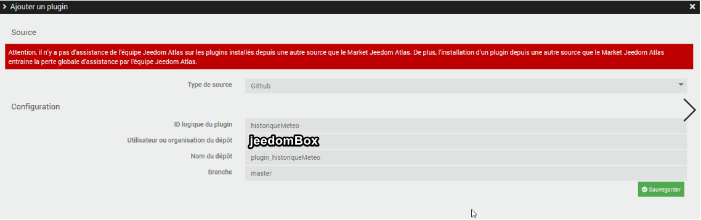
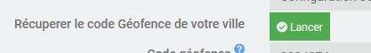
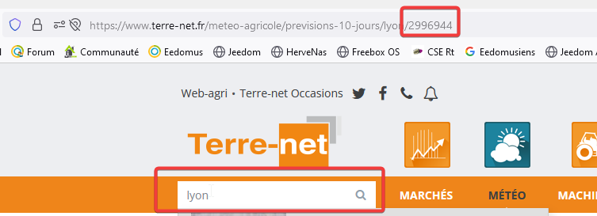
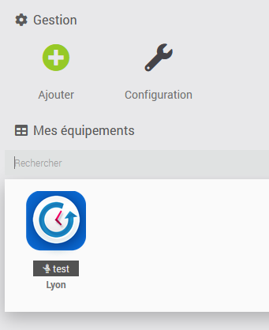
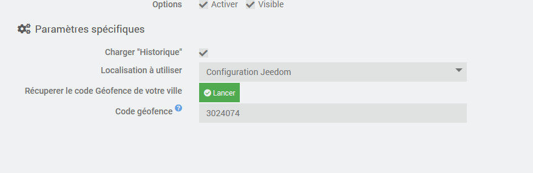

# plugin-historiqueMeteo

## Fonctions

Plugin permettant de récupérer les données d'historique Méteo. Et plus particulierement la quantité de pluie tombée par jour et par mois.
 Les données n'étant pas mises à disposition en temps réel, le plugin récupère chaque jour les données de la veille. 
 Utilisation du site <a href="https://www.terre-net.fr" target="_blank"> www.terre-net.fr</a> afin de récupérer les données

## Installation du plugin
Par source Github:
* Aller dans Jeedom menu Plugins / Gestion des plugins
* Sélectionner le symbole + (Ajouter un plugin)
* Sélectionner le type de source Github (Il faut l'avoir autorisé au préalable dans le menu Réglages / Système / Configuration => Mise à jour/Market)
* Remplir les champs:
  * ID logique du plugin : **historiqueMeteo**
  * Utilisateur ou organisation du dépôt : **jeedomBox**
  * Nom du dépôt : **plugin_historiqueMeteo**
  * Branche : **master**
  * => Puis valider par le bouton "Enregistrer"

  

* Rafraichir la page: Le plugin "historiqueMeteo" doit apparaitre. Sélectionner son symbole pour aller dans sa page de configuration.
* Sur la page de configuration du plugin:
  * Activer le plugin
  * Ajouter votre code géofence.
  * Sauvegarder
 

## Obtention d'un code "geofence"
2 méthodes pour récupérer le code Géofence:
  * Automatique: il suffit de cliquer sur le bouton "Lancer".
 

  

  * Manuellement:
    Visitez le site <a href="https://www.terre-net.fr/meteo-agricole/previsions-10-jours/lyon/2996944" target="_blank">Géofence </a>
     Saisissez une ville et récupérez le code Géofence dans l'url
     Exemple: pour Lyon le code attendu est 2996944
 

  

## Création de l'équipement (de votre ville)
Aller dans le menu "plugins/meteo/Metéo Historique" de jeedom pour créer votre équipement.
Cliquer sur Ajouter.

  

## Options
* Charger l'Historique : Permet de recupérer l'historique depuis l'année 2013.
* Récupérer le code géofence de votre ville.  Il se base sur les données que vous avez renseignée dans les paramètres de Jeedom.  Il est necessaire d'avoir installer le plugin Geoloc. <a href="https://doc.jeedom.com/fr_FR/plugins/organization/geoloc/" target="_blank">Geoloc</a>

  

